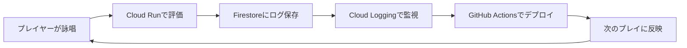

# ハッカソン要件対応

DevOps × AI Agent Hackathon の審査基準に対して、本企画がどう応えるかを整理する。

---

## 3コンセプト対応

### つくる

**何を作るか：** AIゲームマスターエージェント + 2Dアクションゲーム

| 成果物 | 内容 |
|---|---|
| Unity製2Dゲーム | 見下ろし型アクションRPG、ローグライク構成 |
| Cloud Run API | AI魔導書エージェントのバックエンド |
| 詠唱評価モデル | Speech-to-Text + Gemini APIの組み合わせ |
| 呪文生成パイプライン | Geminiが毎フロアごとに呪文を動的生成 |

### まわす

**継続的に動かす仕組み：** DevOps × AIの改善サイクル

- GitHub Actions：コードPush時に自動テスト・Cloud Runへ自動デプロイ
- Cloud Logging：詠唱評価ログ・エラーログを収集
- Firestore：プレイヤーごとのセッションログを蓄積
- ログをもとにGeminiのプロンプトを改善するサイクルを設計

### とどける

**誰に、何を届けるか：** 審査員・観客に「AIが変えるゲーム体験」を30秒で届ける

- 声で詠唱 → AIがリアルタイムに判断 → 画面が変わる、というループを1セッションで体験
- 配信映え：叫んだり、詠唱を失敗したりする姿がそのままコンテンツになる
- 詳細は [[07_発表デモ構成]] を参照

---

## 必須要件チェック

| 要件 | 使用プロダクト / 方法 | 対応状況 |
|---|---|---|
| アプリケーション実行 | **Cloud Run**（AI魔導書APIをデプロイ） | 対応 |
| Google Cloud AI技術 | **Gemini API**（呪文生成・評価・GMジャッジ） | 対応 |
| Google Cloud AI技術 | **Speech-to-Text**（詠唱音声認識） | 対応 |
| Google Cloud AI技術 | **Text-to-Speech**（AI魔導書の読み上げ） | 対応 |
| DevOps：CI/CD | **GitHub Actions**（Push→テスト→Cloud Runデプロイ） | 対応 |
| DevOps：ログ収集 | **Cloud Logging**（詠唱・評価ログ） | 対応 |
| DevOps：改善サイクル | ログ分析 → Geminiプロンプト改善 → 再デプロイ | 対応 |

---

## ハッカソン審査で刺さるポイント

1. **AIの自律判断が明確**：Geminiがプレイヤーのログを読んで次の難易度・呪文を決定
2. **DevOpsが機能している**：ゲームのログが改善サイクルの入力になる
3. **Cloud Runが必然**：AI魔導書エージェントはステートレスAPIとしてCloud Runに最適
4. **デモが映える**：観客も巻き込めるインタラクティブな発表

---

## 関連ノート

- [[00_概要]]
- [[03_AIエージェント設計]]
- [[05_技術構成]]
- [[07_発表デモ構成]]
