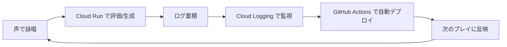

# ハッカソン要件・審査基準（確定版）

> **このページが「何を作れば／何で評価されるか」の最終リファレンス。** 実装判断に迷ったらここに戻る。
> イベント: **DevOps × AI Agent Hackathon 2026 (Findy)** ／ 提出〆切 **2026-07-10 23:59**

---

## 0. 提出物チェックリスト（7/10 23:59）

- [ ] **公開GitHubリポジトリURL** — 現状 **private**。締切前に public 化（その前に履歴のsecret確認）
- [ ] **動作するデプロイURL** — Cloud Run(backend) ＋ 公開フロント。締切後も一定期間アクセス維持
- [ ] **Proto Pedia 作品URL** — 初回登録は時間がかかる＆締切直前は混雑 → **早めに登録**

---

## 1. 必須要件（クリア状況）

### 要件A:（必須）Google Cloud アプリ実行プロダクト

候補: App Engine / GCE / GKE / **Cloud Run** / Cloud Functions / TPU・GPU

- **採用: Cloud Run**（FastAPIバックエンドを公開URL化）
- 状態: 🔴 デプロイ未（[#8]）＝**最優先で確保**。これが無いと要件未達＝失格リスク

### 要件B:（必須）Google Cloud AI 技術

候補: Gemini Enterprise Agent Platform(旧Vertex AI) / Gemini API / Gemma・Imagen・Agent Builder / ADK / **Speech-to-Text・Text-to-Speech** / Vision・NLP / Translation

- **採用: Gemini（Vertex AI 経由）＋ Speech-to-Text**（任意で TTS）
- 状態: ✅ 実装済み（`main.py`: `vertexai=True`, project=`voicespellrpg`, `asia-northeast1`）
- → 「**Gemini Enterprise Agent Platform（旧Vertex AI）経由**」の推奨形を満たす

### 任意技術
- **Firebase**（フロント Hosting 候補）／その他自由

> **死守ライン：Cloud Run と Gemini(Vertex) は絶対に外さない。** デプロイが消えると要件未達。

---

## 2. 審査基準（5項目）と確定戦略

### 基準1：AIエージェントが価値の中心か 🔴最重要

公式: 単なる機能でなくAIエージェントが**中核**／**自律的な判断・タスク実行**／**"AIエージェントである必然性"**

**我々の答え＝適応型AIゲームマスターを"エージェントループ"として実装し、その判断を可視化する：**

| エージェントの動き | 実装 |
|---|---|
| 🧭 知覚 | 声を評価（STT＋音響＋一致率） … `/evaluate`（実装済） |
| 🧠 判断 | プレイヤーのクセを分析（プロファイル蓄積） |
| ⚡ 実行 | **次の呪文・難易度を自律生成** … `/generate-spell`（[#12]🔴） |
| 🔁 振り返り | セッション総評＝声のキャラ診断 … `/result`（[#13]） |

**必然性の主張**：毎回同じ問題ではなく、AIが各プレイヤーに合わせて**ゲーム体験を動的生成**する。AIが無ければ成立しない。

- ✅ やること（必達）: `/generate-spell`＋適応＋診断、**デモで「AIの判断過程」を画面表示**（例:「大声型→難易度↑」）
- ❌ `/evaluate` だけ＝「評価して喋るだけの機能」＝**この基準で死ぬ**

### 基準2：課題へのアプローチ・物語の一貫性／妥当性／新規性

公式: 課題と背景・対象ユーザー・提供価値の一貫性／妥当性／新規性

- **課題**: 配信者/VTuberの「**声の個性**」を活かす・可視化するエンタメ体験が存在しない
- **対象**: VTuber・配信者（プライマリ）／ストレス発散・発声を楽しみたい層（セカンダリ）
- **価値**: 声で遊ぶ → AIが個性を見抜く → **配信ネタ＆自己理解**（＝エンタメそのものが価値）
- **新規性**: 音声を"入力手段"でなく"**評価・診断の対象**"にし、AIが体験を動的生成
- 詳細: [[社会的背景_ターゲット]]

> ⚠️ **一貫性の防衛ルール**：「**診断・エンタメ**」で統一する。「声の上達／ボイトレ／矯正アドバイス」とは**名乗らない**（技術精度が追いつかず物語が破綻するため）。課題は"上達"でなく"**個性の可視化・コンテンツ化**"に置く。

### 基準3：ユーザビリティ

公式: 直観的に使える機能／デザイン

- **「ボタンを押して声を出すだけ」**。Webで誰でも即プレイ（インストール不要）
- ローディング・録音中フィードバックを明快に（[#3]/[#17]）

### 基準4：実用性・体験価値の魅力（"突き抜け"で加点）

公式: 課題解決の実用性／効果的アプローチ／**体験が突き抜けているか**

- 体験の核＝**「面白いレスポンス」**：声に対し、意外で的確な反応が返る
- 突き抜けポイント: 叫ぶ→魔法で**群れを一掃**する爽快感 ＋ AIの**キャラ診断**（「囁きの魔王だ」）
- 配信映え: 失敗・絶叫がそのままコンテンツ

### 基準5：実装力

公式: 技術選定の納得度／拡張性／実運用配慮／**必須ツール活用**

- 構成: **Cloud Run ＋ Gemini(Vertex AI) ＋ STT** ／ **GitHub Actions**（CI/CD・進捗自動同期）／ develop運用
- 実運用配慮: Secret管理・CORS・自動デプロイ・ログ自動収集
- 必達: **7/10までに公開URLで動くE2E**（動かなければ実装力ゼロ評価）

---

## 3. DevOps「まわす」サイクル（基準5の見せ場）

- **push → GitHub Actions → Cloud Run 自動デプロイ**（[#8]）＝「まわす」の本体
- ログ自動収集（Cloud Runは標準でCloud Loggingに出力）
- 進捗ドキュメントも GitHub Actions が自動更新（実装済み・DevOpsの実演）

---

## 4. 絶対に外さない優先順位（人員減を前提に絞る）

1. **基準1のAIエージェント核**：`/generate-spell` → 適応 → 診断（[#12]→[#13]）← 全振り
2. **デプロイ**：Cloud Run(backend) ＋ フロント公開（要件A＆基準5・[#8]/[#29]）
3. **物語の一貫性**：診断・エンタメで統一（基準2）
4. **60秒デモで「AIの判断」を可視化**（基準1の必然性を見せる・[#23]）

**カットしてよい（MVP外）**: TTS（[#15]）・Firestore（[#14]・メモリ保持で代替）・凝った演出・フロアの作り込み

---

## 5. やらない／言わない（防衛ライン）

- ❌ 「声が上達する／ボイトレ／発音矯正」と言わない → 学習用に倒れて物語破綻＆技術不足
- ❌ `/evaluate` だけで止めない → AIエージェント不成立（基準1で死ぬ）
- ❌ Cloud Run / Gemini(Vertex) を構成から外さない → 必須要件未達
- ❌ 「科学的に正確な声分析」と主張しない → "魔導書の気まぐれ診断"の体で（[[11_リザルト診断設計]]）

---

## 関連ノート

- [[00_概要]] — コンセプト
- [[03_AIエージェント設計]] — エージェント5役割
- [[社会的背景_ターゲット]] — 課題・ターゲット（基準2）
- [[07_発表デモ構成]] — 60秒デモ（基準1可視化）
- [[10_Web設計書]] — 実装設計
- [[11_リザルト診断設計]] — 診断ロジック
- [[09_役割分担_WBS_ガント]] — 担当・WBS
