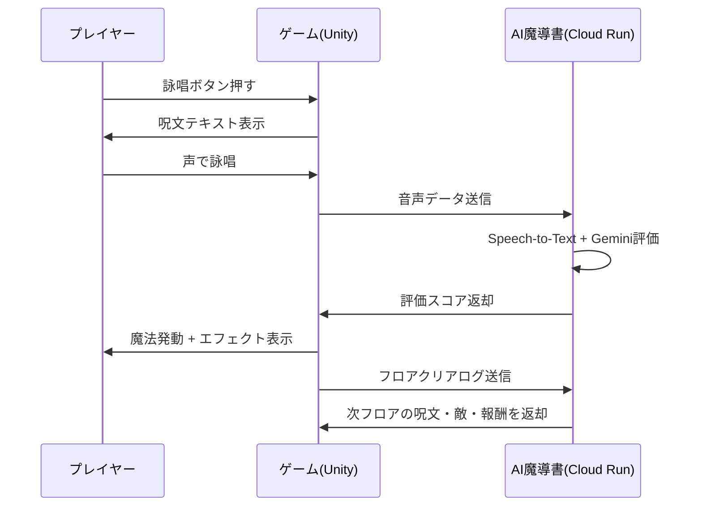

# ゲームシステム

---

## 基本設計

| 項目 | 内容 |
|---|---|
| ジャンル | 2D見下ろし型アクションRPG × ローグライク |
| 操作 | キーボード移動 + 声で呪文発動 |
| 進行 | フロアを突破するごとにAIが次のフロアを動的生成 |
| 終了 | HP0 or 全フロアクリアでリザルト画面へ |

---

## 2D見下ろし型アクション

- プレイヤーキャラを上下左右に移動
- フロアに敵が配置され、接近すると戦闘開始
- 戦闘はリアルタイム。詠唱中は移動不可（詠唱集中モード）

---

## 声で呪文を発動する

1. プレイヤーが「詠唱ボタン」を押す
2. マイクがオンになり、呪文テキストが画面に表示される
3. プレイヤーが声に出して呪文を読み上げる
4. Speech-to-TextがリアルタイムでテキストをAIに送信
5. 評価結果が即座に返り、魔法が発動する

> 評価項目の詳細は [[04_音声詠唱評価項目]] を参照。

---

## ローグライク要素

- フロアはランダム生成（敵配置・地形）
- 呪文はフロアごとにAIが生成（毎回異なる）
- 死亡するとリスタート（進行状況リセット）
- クリア時の報酬もAIが判断して決定

---

## AIによる動的生成

フロアクリアのたびにAIゲームマスターが以下を自律決定する。

```
前フロアの詠唱ログ
  → AIゲームマスター（Gemini）
    ├─ 次の呪文の難易度（文字数・発音難易度）
    ├─ 次の敵構成（数・HP・速度）
    ├─ 報酬内容（HP回復・呪文強化・ボーナス）
    └─ 煽りコメント（AIがプレイヤーに向けて一言）
```

---

## ゲーム終了後のリザルト画面

| 表示項目 | 内容 |
|---|---|
| セッション全体の詠唱ログ | 各フロアで詠唱した呪文と評価 |
| ベスト詠唱 | 最高スコアを記録した詠唱の再生 |
| AI評価コメント | AIゲームマスターによる総評 |
| 得意な詠唱スタイル | 大声・早口・長文など |
| 苦手な詠唱パターン | 失敗が多かった呪文のタイプ |
| スコア | 総合点 + 詠唱評価の内訳 |

---

## 戦闘フロー図



---

## 関連ノート

- [[03_AIエージェント設計]]
- [[04_音声詠唱評価項目]]
- [[06_MVP開発計画]]
