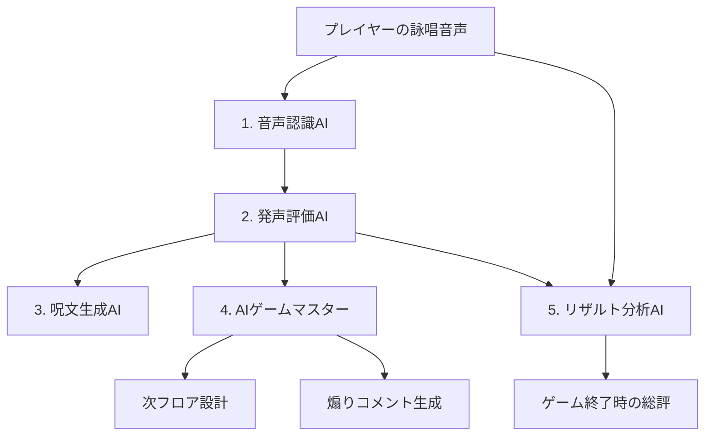
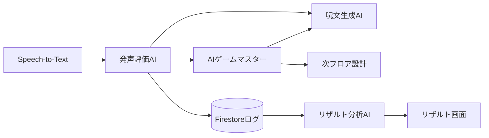

# AIエージェント設計

AI GrimoireにおけるAIは「単機能のツール」ではなく、**ゲーム体験全体を自律的に設計するエージェント**である。

---

## エージェント構成の全体像



---

## 1. 音声認識AI

**役割：** プレイヤーの声をテキストに変換する

- 使用技術：Google Cloud Speech-to-Text
- 入力：マイクからの音声ストリーム
- 出力：認識テキスト、信頼スコア、タイムスタンプ
- ポイント：完全一致ではなく、**一致率・音量・速度**を出力として扱う

---

## 2. 発声評価AI

**役割：** 音声の質・感情・癖を多次元で評価する

- 使用技術：Gemini API（音声評価プロンプト）+ Speech-to-Text メタデータ
- 入力：認識テキスト + 音声メタデータ（音量・速度・感情スコア）
- 出力：評価スコア群（詳細は [[04_音声詠唱評価項目]] 参照）

評価例：
```json
{
  "match_rate": 0.92,
  "volume": "loud",
  "speed": "fast",
  "emotion": "excited",
  "stability": 0.78,
  "hesitation_count": 1
}
```

---

## 3. 呪文生成AI

**役割：** プレイヤーの特性に合わせた呪文テキストを生成する

- 使用技術：Gemini API
- 入力：プレイヤーの詠唱履歴、得意パターン、難易度設定
- 出力：呪文テキスト（1〜4文、発音難易度付き）

生成指示の例：
> 「このプレイヤーは大声が得意だが長文が苦手。中程度の長さで発音しやすい厨二病セリフを生成せよ。」

---

## 4. AIゲームマスター（中核エージェント）

**本企画の主役。** プレイヤーのすべてのログを読み、次のゲーム体験を自律的に設計する。

### 入力
- 各フロアの詠唱評価ログ
- プレイヤーのHP、残存フロア数
- 詠唱成功/失敗パターンの履歴

### 判断・出力

| 判断項目 | 内容 |
|---|---|
| 呪文難易度 | 得意に合わせて上げる / 苦手で詰まっているなら緩める |
| 次の呪文 | プレイヤーの語彙・発音傾向に合わせて生成 |
| 敵構成 | 詠唱が早い人には素早い敵を / 慎重な人には強敵を |
| 報酬内容 | 成功率が高いほど高レアを出す |
| 煽りコメント | プレイヤーを笑わせ・挑発し・鼓舞する一言 |

### AIゲームマスターのプロンプト設計方針

- 役割定義：「あなたはプレイヤーの才能を見抜く魔導書の精霊です」
- ログを構造化JSONで渡し、次フロア設定をJSON形式で出力させる
- 判断根拠もコメントとして出力（デバッグ + デモ演出に使用）

---

## 5. リザルト分析AI

**役割：** セッション全体を振り返り、プレイヤーを総評する

- 使用技術：Gemini API
- 入力：全フロアの詠唱ログ、評価スコアの集計
- 出力：
  - ベスト詠唱（最高スコアのフロア）
  - 得意スタイル（大声・早口・長文など）
  - 苦手パターン
  - AIからのひとこと総評

---

## エージェント間のデータフロー



---

## 関連ノート

- [[00_概要]]
- [[04_音声詠唱評価項目]]
- [[05_技術構成]]
- [[07_発表デモ構成]]
