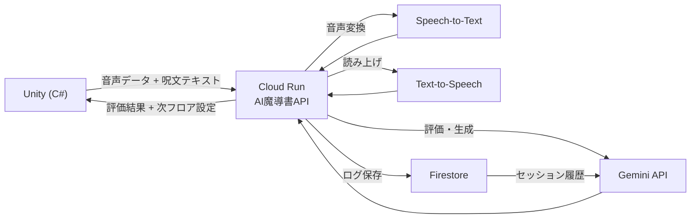

# 技術構成

---

## 技術スタック一覧

| レイヤー | 技術 | 役割 |
|---|---|---|
| ゲームクライアント | **Unity** | 2Dゲーム本体、UIレンダリング |
| ゲームロジック | **C#** | 戦闘・移動・詠唱フロー制御 |
| 音声認識 | **Google Cloud Speech-to-Text** | 詠唱音声をテキスト変換 |
| AI判断エンジン | **Gemini API** | 呪文生成・評価・AIゲームマスター判断 |
| AI音声 | **Google Cloud Text-to-Speech** | AI魔導書の読み上げ（呪文発表・煽り） |
| APIサーバー | **Cloud Run** | AI魔導書エージェントのバックエンド |
| データ保存 | **Firestore** | プレイヤーごとの詠唱ログ・セッション保存 |
| CI/CD | **GitHub Actions** | Push時の自動テスト + Cloud Runへの自動デプロイ |
| ログ監視 | **Cloud Logging** | 詠唱評価ログ・エラーログ収集・可視化 |

---

## データフロー



---

## 各コンポーネント詳細

### Unity（ゲームクライアント）

- 2D Sprite + Tilemap でマップ描画
- マイク入力はUnityの `Microphone` クラスで取得
- WebGL or スタンドアロンビルド（デモ用途に合わせて選択）
- Cloud Run APIとはHTTP（REST）で通信

### Cloud Run（AI魔導書API）

- Python（FastAPI）で構築
- ステートレスAPIとして設計
- エンドポイント例：
  - `POST /evaluate` - 音声評価
  - `POST /generate-spell` - 次の呪文生成
  - `POST /master-judge` - AIゲームマスター判断
  - `GET /result/{session_id}` - セッション総評取得

### Gemini API 活用方法

| 用途 | プロンプト設計 |
|---|---|
| 発声評価 | 評価スコアのJSONを渡して多次元スコアを返す |
| 呪文生成 | プレイヤー特性ログを渡して呪文テキストを生成 |
| AIゲームマスター判断 | フロアクリアログを渡して次フロア構成JSONを返す |
| リザルト総評 | 全セッションログを渡して評価コメントを生成 |

### GitHub Actions CI/CD

```yaml
# デプロイフロー概要
on: [push to main]
jobs:
  test:
    - Python単体テスト（評価ロジック）
  deploy:
    - Docker build
    - Google Artifact Registryへpush
    - Cloud Runへデプロイ
```

---

## 環境構成

| 環境 | 用途 |
|---|---|
| ローカル | Unity開発 + FastAPI開発 |
| Cloud Run（dev） | PRマージ時の自動デプロイ先 |
| Cloud Run（prod） | デモ本番環境 |
| Firestore | ローカル・本番共通（コレクション分離） |

---

## 関連ノート

- [[03_AIエージェント設計]]
- [[01_ハッカソン要件対応]]
- [[06_MVP開発計画]]
- [[08_リスクと対策]]

### Unity / Claude Code 開発ナレッジ

- [[Unity MCP統合]] — Claude CodeとUnity Editor のMCP接続
- [[Unity AI公式ツール 2026]] — Unity 6.0+ 公式AI機能
- [[Claude CodeとCodexによるUnity 2Dゲーム開発の概要]] — AI支援開発の全体像
- [[Unity プロジェクトのCLAUDE.md設計]] — このプロジェクト向けCLAUDE.md設計の参考
