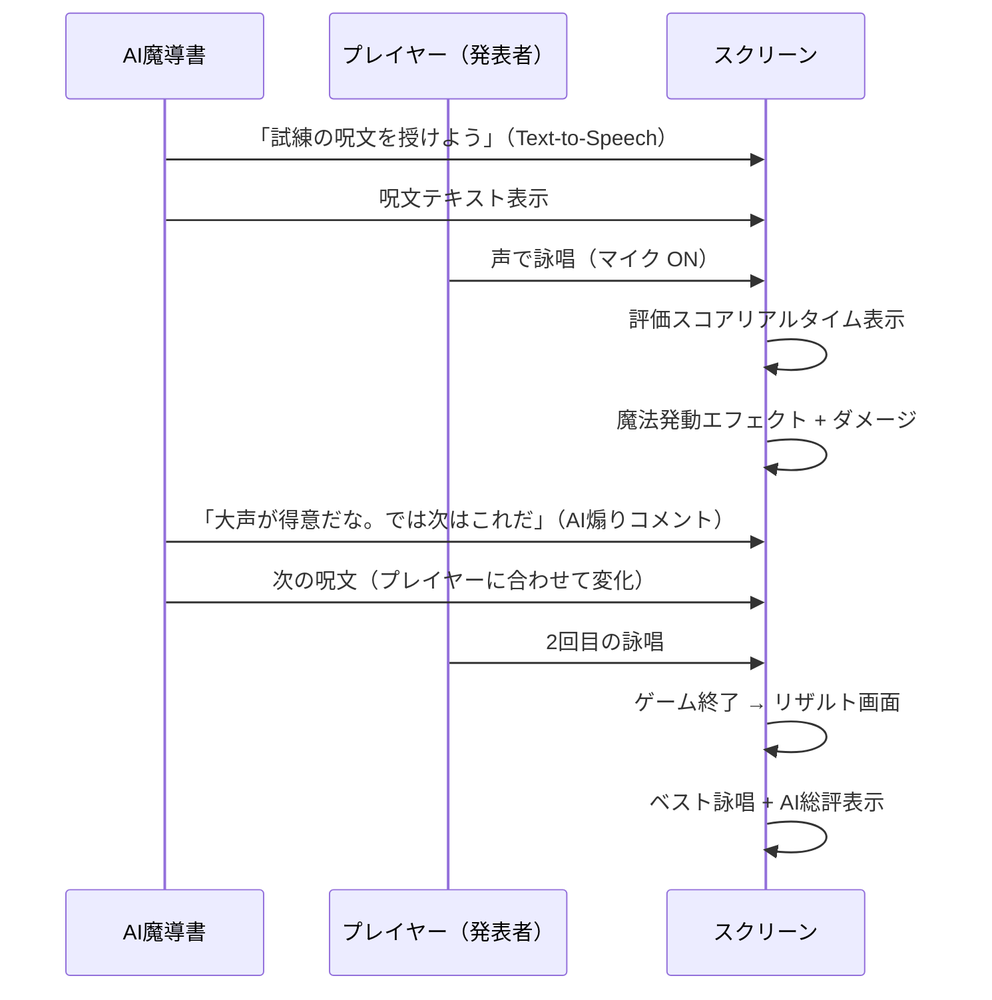

# 発表デモ構成

**目標：30〜60秒で「AIがゲームを変えている」を伝える。**

---

## デモの流れ

---

## タイムライン（60秒想定）

| 時間 | 内容 |
|---|---|
| 0〜10秒 | AI魔導書が登場し、呪文を読み上げる |
| 10〜25秒 | プレイヤーが詠唱 → スコア表示 → 魔法発動 |
| 25〜35秒 | AIが「〇〇が得意」と分析コメント → 次の呪文を変化させて提示 |
| 35〜50秒 | 2回目の詠唱 → 違う呪文で違う演出 |
| 50〜60秒 | リザルト画面 → AI総評 → 締めのトーク |

---

## 強調ポイント

### AIが「適応している」を見せる

- 1回目と2回目で**呪文が変わる**ことを明示
- AIのコメント（「君は大声が得意だ」）を画面に出す
- 変化の根拠が「プレイヤーのログ」であることを発表者が口頭で補足

### 配信映えのポイント

- 発表者が声を張って詠唱する（笑いが起きる）
- 恥ずかしいセリフでも大声で言えると高威力（観客巻き込み）
- 詠唱失敗で魔法が暴発するシーンを意図的に見せる

### 審査員に覚えてもらうための工夫

- 企画名「AI Grimoire（AI グリモワール）」をロゴとして画面に常時表示
- AI魔導書のキャラクター（アイコン）を顔として見せる
- 「声で戦うAIゲームマスター体験」という一文をスライドに入れる

---

## 審査員向け説明ポイント（30秒版）

> 「AI Grimoireは、声で呪文を詠唱するRPGです。
> ただし単なる音声認識ゲームではありません。
> AIゲームマスターがプレイヤーの詠唱ログを分析し、
> 次の呪文・難易度・報酬を自律的に変化させます。
> Cloud Run上で動くAIエージェントが、
> GitHub ActionsでCI/CDされ、Firestoreにログを蓄積しながら、
> プレイヤーに合わせてゲームそのものを動的に作り続けます。」

---

## スライド構成（補助資料）

1. タイトル：AI Grimoire
2. 一言コンセプト
3. デモ（ここでゲームを起動）
4. AI側のアーキテクチャ図（Mermaid）
5. ハッカソン要件対応表
6. 今後の展開

---

## デモ時のリスク対策

| リスク | 対策 |
|---|---|
| 音声認識が失敗する | 「失敗もゲーム体験です」と笑いに変換。失敗ログもAIに渡る |
| Cloud Runが遅延する | レスポンス中のローディングアニメーションを用意 |
| マイクが拾えない | バックアップ：テキスト入力モードを隠しで用意 |
| 緊張してうまく詠唱できない | 「緊張も評価対象です」とプレゼンに組み込む |

---

## 関連ノート

- [[00_概要]]
- [[01_ハッカソン要件対応]]
- [[06_MVP開発計画]]
- [[08_リスクと対策]]
