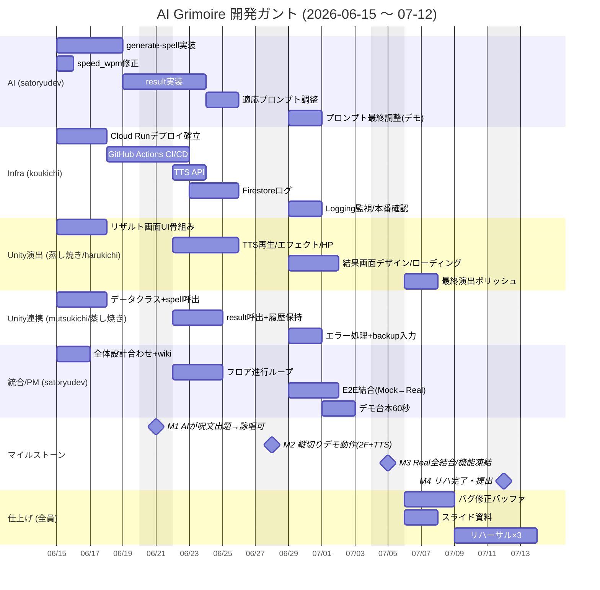

# 役割分担・WBS・ガントチャート

**前提：残り約4週間（2026-06-15 〜 07-12）／5人・初心者多め・全員 Claude Code 所持。**
難所（GCP/STT/Cloud Run）は1人に集約し、他は Claude Code で補完できる粒度に分割する。

> 現状：`/evaluate`（STT + librosa + Gemini コメント）まで実装済み。
> 「目当てのゲーム＝適応型AIゲームマスター」を成立させるには、以下の残作業が必要。

---

## 1. 役割分担（確定版）

| # | 役割 | 担当者 |
|---|---|---|
| 1 | **PM／リーダー／統合** | satoryudev |
| 2 | Unity見た目・演出 | mutsukichi・蒸し焼き・harukichi |
| 3 | Unity↔APIつなぎ | mutsukichi・蒸し焼き |
| 4 | バックエンドAI（Gemini） | satoryudev |
| 5 | インフラ／デプロイ | satoryudev・koukichi |

### 担当ごとの責務

| 担当者 | 持ち役割 | 主な責務 |
|---|---|---|
| **satoryudev** | 1・4・5 | PM・進行管理・シーン統合・フロア進行・Gemini AI・Cloud Run／デプロイ統括 |
| **mutsukichi** | 2・3 | UI・演出 ＋ UnityWebRequest 連携 |
| **蒸し焼き** | 2・3 | UI・演出 ＋ UnityWebRequest 連携 |
| **koukichi** | 5 | インフラ実質オーナー（Cloud Run／CI/CD／Firestore／TTS API） |
| **harukichi** | 2 | UI・演出（リザルト画面・エフェクト中心） |

> 保険：5(インフラ)は GCP で詰まりやすいため、**koukichi を実質オーナー**にして satoryudev は指揮に回れるようにする。

---

## 2. WBS（作業分解）

| ID | ワークパッケージ | 担当 | 目安 |
|---|---|---|---|
| **1. Backend AI** | | | |
| 1.1 | `/generate-spell` 実装（Gemini呪文生成） | satoryudev | 4d |
| 1.2 | `/result` 実装（リザルト分析AI・総評） | satoryudev | 3d |
| 1.3 | 適応プロンプト調整（履歴で呪文が変化） | satoryudev | 2d |
| 1.4 | `speed_wpm` 修正（word_time_offsets使用） | satoryudev | 1d |
| **2. Infra/DevOps** | | | |
| 2.1 | Cloud Runデプロイ確立（現状/evaluateを本番に） | koukichi | 3d |
| 2.2 | GitHub Actions CI/CD（push→デプロイ） | koukichi | 3d |
| 2.3 | Firestoreセッションログ蓄積 | koukichi | 3d |
| 2.4 | Text-to-Speech API（呪文音声生成） | koukichi | 2d |
| 2.5 | Cloud Logging監視・Secret/環境変数管理 | koukichi | 2d |
| **3. Unityゲーム本体** | | | |
| 3.1 | 呪文出題表示（出された呪文を画面に） | 蒸し焼き | 2d |
| 3.2 | TTS音声再生（AI魔導書の読み上げ） | 蒸し焼き | 2d |
| 3.3 | リザルト画面（ベスト詠唱＋AI総評） | harukichi | 3d |
| 3.4 | 魔法エフェクト・HPゲージ・ローディング仕上げ | harukichi | 4d |
| 3.5 | フロア進行ループ（2フロア／次呪文連携） | satoryudev | 3d |
| **4. Unity↔API連携** | | | |
| 4.1 | データクラス追加（SpellData/ResultData） | mutsukichi | 2d |
| 4.2 | generate-spell / result 呼び出し実装 | mutsukichi | 3d |
| 4.3 | セッションプロファイル管理（Unity側で履歴保持） | mutsukichi | 2d |
| 4.4 | Mock更新＋useMock切替フロー | 蒸し焼き | 2d |
| **5. 統合・デモ・PM** | | | |
| 5.1 | E2E結合（Mock→Real全切替） | satoryudev | 3d |
| 5.2 | デモ60秒台本・リスク対策（テキスト入力backup） | satoryudev | 2d |
| 5.3 | スライド資料 | satoryudev | 2d |
| 5.4 | リハーサル×3・進行管理・hot.md更新 | 全員 | 2d |

---

## 3. ガントチャート

---

## 4. 週次サマリ＆マイルストーン

| 週 | 期間 | ゴール | マイルストーン |
|---|---|---|---|
| W1 | 6/15-6/21 | 基盤拡張：generate-spell＋Cloud Run本番化 | **M1** AIが呪文を出題→Unityで詠唱できる |
| W2 | 6/22-6/28 | AI適応＋演出：result／TTS／2フロア | **M2** 縦切りデモが通る |
| W3 | 6/29-7/5 | Real API全結合＋デモ化 | **M3** 機能凍結・台本確定 |
| W4 | 7/6-7/12 | 仕上げ・リハ・バッファ | **M4** リハ完了・提出 |

**クリティカルパス**：`1.1 generate-spell → 3.5 フロア進行 → 5.1 E2E結合 → リハ`。
ここが詰まるとデモが成立しないため最優先。

---

## 関連ノート

- [[06_MVP開発計画]]
- [[07_発表デモ構成]]
- [[03_AIエージェント設計]]
- [[tech/API設計]]
- [[hot]]
