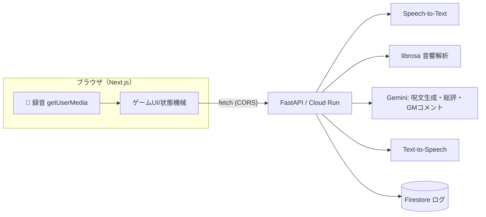

# Web版 設計書（着手用）

**この1枚を読めば、各自が自分の担当ファイルから実装に入れる**ことを目的にした設計書。
UnityをやめてWebアプリ（Next.js）に切り替える。**バックエンド（FastAPI on Cloud Run）はそのまま流用**。

> 前提：提出〆切 2026-07-10 / 提出物 = 公開GitHub・**動作確認できるデプロイURL**・Proto Pedia。
> 声が核なので、ブラウザ標準の `getUserMedia` が使えるWebが最適（Unity WebGLはマイク非対応のため不採用）。

---

## 1. 全体アーキテクチャ



- フロント（Next.js）は **ブラウザから直接 FastAPI を叩く**（バックエンドにCORS設定を入れる）。
- バックエンドのエンドポイントとデータ形式は [[tech/API設計]] を踏襲（**フィールドは snake_case 厳守**）。

---

## 2. 技術スタック（確定）

| レイヤ | 採用 | 備考 |
|---|---|---|
| フロント | **Next.js (App Router) + TypeScript** | ゲーム本体はクライアントコンポーネント |
| 状態管理 | `useReducer` + 自作hook（`useGame`） | 追加ライブラリ不要・初心者向け |
| スタイル/演出 | CSS Modules or Tailwind + CSSアニメ（必要なら Framer Motion） | 派手さはここで担保 |
| 音声録音 | `getUserMedia` + `MediaRecorder` | webm/opus で録る（後述の注意あり） |
| バックエンド | **FastAPI on Cloud Run（既存流用）** | Gemini/STT/TTS/Firestore |
| フロント配信 | Vercel（最速） or Firebase Hosting / Cloud Run（Google統一） | デプロイURL=提出物 |

---

## 3. フォルダ構造（`frontend/`）

```
frontend/
├── app/
│   ├── layout.tsx          # ルートレイアウト・next/fontでフォント
│   ├── page.tsx            # ゲーム本体（'use client'。useGameをマウントし画面を出し分け）
│   └── globals.css
├── components/
│   ├── TitleScreen.tsx     # タイトル・スタート
│   ├── SpellCard.tsx       # 呪文テキスト表示＋TTS再生
│   ├── RecordButton.tsx    # 🎤 押下で録音・離して送信
│   ├── EvaluatingOverlay.tsx  # API待ちローディング（魔法陣）
│   ├── BattleScene.tsx     # 敵・HPバー・ヒット演出（将来：群れ殲滅）
│   ├── EvaluationBars.tsx  # 一致率/音量/速度…のバー
│   ├── GMComment.tsx       # AI魔導書の煽りコメント
│   └── ResultScreen.tsx    # ベスト詠唱・得意/苦手・AI総評
├── lib/
│   ├── types.ts            # API型（snake_case）
│   ├── api.ts              # fetchラッパ（generateSpell / evaluate / getResult）
│   ├── audio.ts            # 録音（getUserMedia + MediaRecorder）
│   └── useGame.ts          # 状態機械（useReducer）
├── public/                 # スプライト・画像（後で追加）
├── .env.local              # NEXT_PUBLIC_API_BASE_URL=...
├── next.config.ts
├── package.json
└── tsconfig.json
```

> ゲームは操作中心なので、`page.tsx` と各コンポーネントは基本 `'use client'`。

---

## 4. 画面・状態遷移（状態機械）

`useGame` が持つ状態は1つ。`page.tsx` は状態に応じて画面を出し分けるだけ。

```
title ──START──▶ presenting ──(generate-spell完了)──▶ ready
ready ──押下──▶ recording ──離す──▶ evaluating ──(evaluate完了)──▶ result
result ──敵HP>0──▶ ready（同じ敵にもう一度）
result ──敵撃破&次フロア──▶ presenting（⭐適応した新呪文）
result ──敵撃破&最終──▶ gameResult（result API → 総評）
```

| 状態 | 画面 | 表示コンポーネント |
|---|---|---|
| `title` | タイトル | TitleScreen |
| `presenting` | 呪文出題＋読み上げ | SpellCard |
| `ready` | 詠唱待ち | SpellCard + RecordButton + BattleScene |
| `recording` | 録音中 | RecordButton(録音中) |
| `evaluating` | 評価中 | EvaluatingOverlay |
| `result` | 発動・ダメージ・コメント | EvaluationBars + BattleScene + GMComment |
| `gameResult` | リザルト | ResultScreen |

`useGame` の state（例）:
```ts
type Phase = 'title'|'presenting'|'ready'|'recording'|'evaluating'|'result'|'gameResult';
interface GameState {
  phase: Phase;
  session_id: string;
  floor: number;
  spell: SpellData | null;        // 現在の呪文
  last: EvaluationResult | null;  // 直近の評価
  enemy_hp: number;
  history: EvaluationResult[];    // 適応のため蓄積（generate-spellに渡す）
}
```

---

## 5. API契約（フロント⇄バックの取り決め）

**フィールドは snake_case 厳守**（TS側も変換せずそのまま）。詳細は [[tech/API設計]]。

### `POST /evaluate`（実装済み）
- リクエスト：`multipart/form-data` … `audio_file`(録音), `spell_text`, `session_id`, `floor_id`
- レスポンス：
```ts
interface EvaluationResult {
  transcript: string;
  match_rate: number;
  volume: 'loud' | 'normal' | 'quiet';
  speed_wpm: number;
  completion_rate: number;
  hesitation_count: number;
  confidence: number;
  gm_comment: string;
  spell_power: number;
}
```

### `POST /generate-spell`（未実装・[#12] 最優先）
- リクエスト(JSON)：`session_id`, `floor_id`, `player_profile`
- レスポンス：
```ts
interface SpellData {
  spell_text: string;
  difficulty: number;
  spell_type: string;          // 'fire' など
  expected_length_sec: number;
}
```

### `GET /result/{session_id}`（未実装・[#13]）
```ts
interface ResultData {
  session_id: string;
  total_floors: number;
  best_floor: { floor_id: string; spell_text: string; spell_power: number };
  strong_style: string;
  weak_style: string;
  ai_review: string;
  overall_score: number;
}
```

`lib/api.ts` はこの3つの薄いラッパ関数（`generateSpell()`, `evaluate()`, `getResult()`）を提供する。`NEXT_PUBLIC_API_BASE_URL` をベースに `fetch`。

---

## 6. 🎤 音声録音の方式（重要な注意点）

- ブラウザ：`getUserMedia` → `MediaRecorder` で録音 → **既定は `audio/webm; codecs=opus`** の Blob。
- これを `audio_file` として `/evaluate` にPOST。
- ⚠️ **バックエンド側の対応が必要**：Google STT は webm/opus をそのままだと扱えない場合がある。
  - 推奨：**バックエンドで webm → WAV に変換**（Dockerfileに ffmpeg 導入済み）してから STT・librosa に渡す。
  - or STTの `encoding=WEBM_OPUS, sample_rate=48000` を指定。
  - → これは **backend担当(satoryudev)のタスク**。フロントは webm をそのまま送ればよい設計にする。

---

## 7. 環境・デプロイ・CORS

- フロント env：`NEXT_PUBLIC_API_BASE_URL`（ローカル=`http://localhost:8080`、本番=Cloud RunのURL）
- バックエンド：**CORSミドルウェア追加が必須**（フロントのオリジンを許可）。← backend/infra担当
- デプロイ：
  - バックエンド = Cloud Run（提出の「動作するアプリ」）
  - フロント = Vercel（push→自動デプロイが最速）or Firebase/Cloud Run（Google統一）
  - **デプロイURL＝提出物**。締切後もアクセス維持。

---

## 8. 担当割り当て（このファイルに着手できる）

| 担当 | 作るファイル | 役割 |
|---|---|---|
| **mutsukichi**(nyanko12) | `lib/types.ts` `lib/api.ts` `lib/audio.ts` `lib/useGame.ts` | API連携・録音・状態機械（フロントの土台） |
| **蒸し焼き**(kazuma660) | `TitleScreen` `SpellCard` `RecordButton` `EvaluatingOverlay` | 入口〜詠唱までのUI/演出 |
| **harukichi**(Haruku-Sato) | `BattleScene` `EvaluationBars` `GMComment` `ResultScreen` | 戦闘演出〜リザルトのUI |
| **satoryudev** | backend `/generate-spell` `/result` ・webm→WAV変換・プロンプト・`page.tsx`統合 | AI＋全体統合＋PM |
| **koukichi**(koki1005) | Cloud Runデプロイ・CI/CD・CORS・env・TTS API・フロント配信 | インフラ／DevOps |

> 依存関係：`lib/types.ts`（mutsukichi）が最初にできると、全員が型を見ながら並行作業できる。**最優先で型を確定**。

---

## 9. 着手手順（共通）

```bash
# 初回（frontendが用意できたら）
cd frontend
npm install
echo "NEXT_PUBLIC_API_BASE_URL=http://localhost:8080" > .env.local
npm run dev          # http://localhost:3000

# バックエンドはローカルで別途起動（既存手順）
cd backend && source .venv/bin/activate && uvicorn main:app --reload --port 8080
```

ブランチ運用は develop ベース（[[TEAM_START_HERE]] 参照）：
```bash
git checkout develop && git pull
git switch -c feat/<issue番号>-<内容>
# 作業 → push → gh pr create（develop宛て）
```

---

## 10. 段階スコープ（積む順番）

| 段階 | 内容 | 状態 |
|---|---|---|
| ✅ MVPコア（必達） | 1〜少数の敵で 出題→詠唱→評価→ダメージ→**適応した次呪文** | まずここを完成 |
| 🟡 ヴァンサバ風レイヤー | 群れ＋「声で全体殲滅」演出に差し替え（BattleScene拡張） | コアが動いてから |
| 🟡 TTS読み上げ | SpellCardで音声再生 | 余裕があれば |
| ❌ 移動・物理・大量敵の本格アクション | やらない（声の詠唱ループに全振り） | 対象外 |

---

## 関連ノート

- [[tech/API設計]] — エンドポイント詳細
- [[09_役割分担_WBS_ガント]] — 担当・WBS・ガント
- [[03_AIエージェント設計]] — AIの役割
- [[07_発表デモ構成]] — 60秒デモ
- [[hot]]
