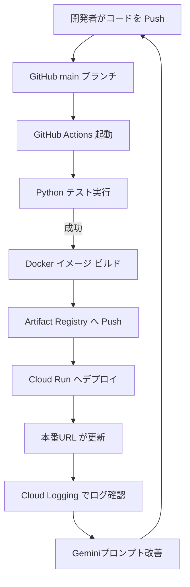

# GitHub Actions と CI/CD

AI Grimoire のバックエンド（Cloud Run）を継続的にデプロイする仕組みの設計ノート。ハッカソン要件の「DevOps」部分に直接対応する。

---

## 役割

| 役割 | 内容 |
|---|---|
| 自動テスト | Python コードの単体テスト（評価ロジック等） |
| 自動ビルド | Docker イメージをビルド |
| 自動プッシュ | Artifact Registry にイメージをプッシュ |
| 自動デプロイ | Cloud Run に最新イメージをデプロイ |
| ログ改善サイクル | Cloud Logging のログを見てプロンプトを改善 → Push → 再デプロイ |

---

## 今回のゲームで使う理由

- ハッカソン要件「GitHub Actions・CI/CD・ログ改善サイクル」に直接対応
- main ブランチへの Push だけで Cloud Run が自動更新される
- チーム開発でコンフリクトしにくい
- Workload Identity Federation を使えばサービスアカウントキーをリポジトリに置かなくて済む

---

## デプロイフロー全体



---

## GitHub Actions ワークフロー設計

### 使用するアクション

| アクション | バージョン | 役割 |
|---|---|---|
| `google-github-actions/auth` | v3 | Google Cloud への認証 |
| `google-github-actions/deploy-cloudrun` | v3 | Cloud Run へのデプロイ |
| `docker/build-push-action` | 最新 | Docker ビルド・プッシュ |

### ワークフロー概要（`.github/workflows/deploy.yml`）

```yaml
# 概要イメージ（詳細は公式ドキュメントで確認すること）
on:
  push:
    branches: [main]

jobs:
  test:
    runs-on: ubuntu-latest
    steps:
      - uses: actions/checkout@v4
      - name: Python テスト
        run: |
          pip install pytest rapidfuzz
          pytest tests/

  deploy:
    needs: test
    runs-on: ubuntu-latest
    permissions:
      contents: read
      id-token: write   # Workload Identity Federation に必要

    steps:
      - uses: actions/checkout@v4

      - name: Google Cloud 認証（キーレス）
        uses: google-github-actions/auth@v3
        with:
          workload_identity_provider: ${{ secrets.WIF_PROVIDER }}
          service_account: ${{ secrets.GCP_SERVICE_ACCOUNT }}

      - name: Docker ビルド & Artifact Registry へ Push
        run: |
          gcloud builds submit --tag asia-northeast1-docker.pkg.dev/PROJECT/REPO/ai-grimoire-api

      - name: Cloud Run へデプロイ
        uses: google-github-actions/deploy-cloudrun@v3
        with:
          service: ai-grimoire-api
          region: asia-northeast1
          image: asia-northeast1-docker.pkg.dev/PROJECT/REPO/ai-grimoire-api:latest
```

---

## 認証方式：Workload Identity Federation（推奨）

### 従来方式との比較

| 方式 | サービスアカウントキー | Workload Identity Federation |
|---|---|---|
| セキュリティ | 鍵ファイルをリポジトリに保存（危険） | 鍵ファイル不要 |
| 有効期限 | 手動ローテーション | 1時間で自動失効 |
| 設定難易度 | 簡単 | やや複雑（初回のみ） |
| **推奨** | - | **これを使う** |

### 設定手順（概要）

1. GCP で Workload Identity Pool を作成
2. GitHub リポジトリをプロバイダとして登録
3. サービスアカウントに WIF プリンシパルをバインド
4. GitHub Secrets に `WIF_PROVIDER` と `GCP_SERVICE_ACCOUNT` を設定

> 詳細手順は公式: https://cloud.google.com/blog/products/identity-security/enabling-keyless-authentication-from-github-actions

**ハッカソンで時間がない場合：** サービスアカウントキー（JSON）を GitHub Secrets に入れる方法でも動く（セキュリティは低下するが開発速度優先）。

---

## GitHub Secrets の管理

| シークレット名 | 内容 |
|---|---|
| `WIF_PROVIDER` | Workload Identity Provider のフルパス |
| `GCP_SERVICE_ACCOUNT` | デプロイ用サービスアカウントのメール |
| `GCP_PROJECT_ID` | GCP プロジェクト ID |
| `GEMINI_API_KEY` | （Secret Manager 経由なら不要） |

> **Gemini API キーは** GitHub Secrets ではなく **Secret Manager** で管理することを推奨。Cloud Run に環境変数として注入する。

---

## DevOps 改善サイクルの設計

ハッカソン審査で「DevOps が機能している」を示すために、以下のサイクルを明示する。

```
1. プレイヤーが詠唱する
2. 評価ログが Cloud Logging に蓄積される
3. ログを見て「大声評価の閾値が低すぎる」等の課題を発見
4. Gemini プロンプトや評価パラメータを修正
5. main ブランチに Push
6. GitHub Actions が自動でテスト→デプロイ
7. 新しい評価ロジックが本番に反映される
```

このサイクルをアーキテクチャ図とデモに含めることで審査員へのアピールになる。

---

## 実装時の注意点

- GitHub Actions のワークフローは `tests/` が通過した場合のみデプロイするように `needs: test` を設定
- Cloud Run への初回デプロイは手動でもよい（2回目以降から自動化）
- `asia-northeast1`（東京）リージョンを明示的に指定すること（未指定だと `us-central1` になる）
- Artifact Registry はあらかじめリポジトリを作成しておく必要がある

---

## メリット / デメリット

| メリット | デメリット |
|---|---|
| Push だけでデプロイが完結 | Workload Identity の初期設定が複雑 |
| ハッカソン要件を明確に満たす | ワークフロー YAML のデバッグが難しい |
| テストと連動できる | |

---

## 代替案

| 代替 | 理由 |
|---|---|
| Cloud Build | GCP 完結だが GitHub との連携が別途必要 |
| 手動デプロイ | 速いが DevOps 要件を満たさない |
| GitLab CI | GitHub 縛りなら不要 |

---

## 公式ドキュメント

- google-github-actions/auth: https://github.com/google-github-actions/auth
- google-github-actions/deploy-cloudrun: https://github.com/google-github-actions/deploy-cloudrun
- Workload Identity Federation: https://cloud.google.com/iam/docs/workload-identity-federation-with-deployment-pipelines
- GitHub Actions 公式: https://docs.github.com/en/actions

---

## ハッカソン最低限実装

1. `.github/workflows/deploy.yml` を作成
2. Google Cloud 認証（サービスアカウントキーでも可）
3. Docker ビルド → Cloud Run デプロイ の自動化
4. テストを 1 件以上書いてパイプラインに組み込む

## 発展実装

- Workload Identity Federation によるキーレス認証
- PR ごとのプレビュー環境（Cloud Run のリビジョンで実現）
- Cloud Logging → アラート通知の設定

---

## 関連ノート

- [[tech/Google Cloud構成]]
- [[tech/バックエンド構成]]
- [[01_ハッカソン要件対応]]
