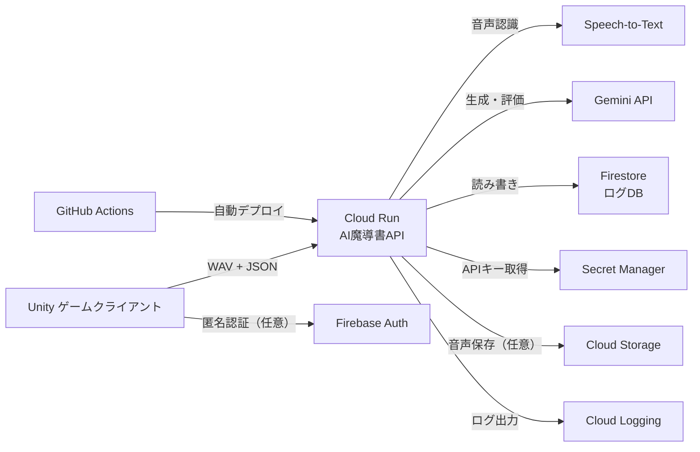
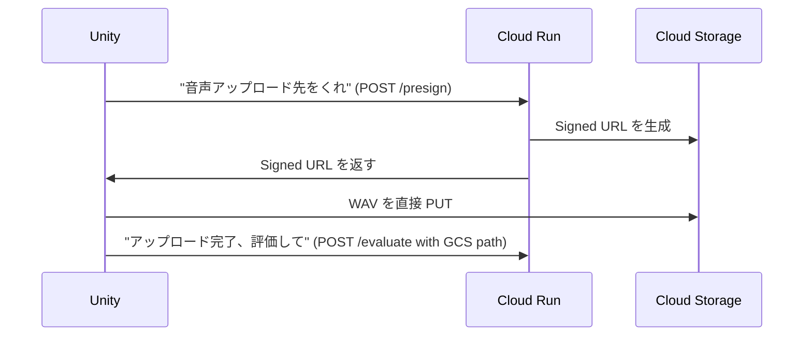

# Google Cloud構成

AI Grimoire が使用する Google Cloud / Firebase サービスの全体構成と各サービスの役割。

---

## 全体アーキテクチャ



---

## 1. Cloud Run

→ 詳細は [[tech/バックエンド構成]] を参照。

**構成メモ：**
- リージョン：`asia-northeast1`（東京）を推奨
- 環境変数：APIキーは直接設定せず Secret Manager から注入
- ポート：8080（FastAPI デフォルト）
- `startup_cpu_boost: true` でコールドスタート短縮

---

## 2. Secret Manager

### 役割

Gemini APIキー・GCPサービスアカウントキー等のシークレットを安全に管理する。Cloud Run の環境変数に直接ハードコードすることを防ぐ。

### 今回のゲームで使う理由

- Gemini API キーを GitHub リポジトリや Cloud Run 設定に平文で書かない
- Cloud Run から Secret Manager を参照すると、Cloud Run のデプロイ設定に APIキーが残らない
- GitHub Actions でのデプロイ時にシークレットをアプリに届ける標準的な方法

### 使い方

**Cloud Run への注入方法（2通り）：**

| 方法 | 説明 | 推奨 |
|---|---|---|
| 環境変数として注入 | シークレットを環境変数にバインド。起動時に解決される | ハッカソン向け（シンプル） |
| ボリュームマウント | ファイルとしてコンテナにマウント。常に最新版を参照 | 本番向け |

**Cloud Run デプロイ設定の例：**
```
--set-secrets=GEMINI_API_KEY=gemini-api-key:latest
→ コンテナ内で os.environ["GEMINI_API_KEY"] として参照可能
```

### 注意点

- Cloud Run サービスアカウントに `roles/secretmanager.secretAccessor` を付与する必要がある
- バージョン管理ができる（ローテーション対応）
- Python から直接アクセスする場合は `google-cloud-secret-manager` パッケージが必要（環境変数注入なら不要）

### メリット / デメリット

| メリット | デメリット |
|---|---|
| APIキーをコードに書かなくて済む | 初期設定が少し手間 |
| IAMで細かくアクセス制御できる | |

### 公式ドキュメント

- Secret Manager: https://cloud.google.com/secret-manager/docs
- Cloud Run でのシークレット利用: https://cloud.google.com/run/docs/configuring/services/secrets

### ハッカソン最低限実装

1. Gemini API キーを Secret Manager に登録
2. Cloud Run サービスに環境変数として注入
3. Python で `os.environ["GEMINI_API_KEY"]` で読む

### 発展実装

- Speech-to-Text のサービスアカウントキーも Secret Manager で管理
- シークレットのローテーション設定

---

## 3. Firestore

→ 詳細は [[tech/バックエンド構成]] を参照。

**構成メモ：**
- データベースモード：Native mode（新規は必ずこちら）
- ロケーション：`asia-northeast1`
- Cloud Run から Firestore への IAM：`roles/datastore.user`

---

## 4. Cloud Storage（オプション）

### 役割

音声ファイル（WAV）を永続保存する。MVP ではログのみ Firestore に保存するため任意。

### 今回のゲームで使う可能性がある場面

- 詠唱音声を後から再生するリザルト画面
- ベスト詠唱をユーザーに聴かせる
- 音声データの保存・分析

### Signed URL を使ったアップロード設計



**ハッカソンでは：** 直接 Cloud Run に multipart POST する方式の方がシンプル。GCS は発展実装。

### 料金

| 項目 | 無料枠 | 超過料金 |
|---|---|---|
| ストレージ | 5 GB / 月 | $0.020 / GB |
| 操作（Class A） | 5,000 回 / 月 | $0.05 / 10,000 件 |
| ダウンロード | 1 GB / 月 | $0.12 / GB |

### 公式ドキュメント

- Cloud Storage: https://cloud.google.com/storage/docs
- Signed URL: https://cloud.google.com/storage/docs/access-control/signed-urls

---

## 5. Firebase Authentication（オプション）

### 役割

Unity クライアントにプレイヤーIDを付与する。完全匿名認証でアカウント作成なしにセッションIDを取得できる。

### 今回のゲームで使う可能性

- プレイヤーごとに Firestore ドキュメントを分離するために使う
- セキュリティルールで「自分のドキュメントしか書けない」制約を実現する

### 匿名認証フロー

```
Unity 起動時
  → Firebase SDK で signInAnonymously()
  → Firebase から UID と ID トークン（JWT）を取得
  → API リクエストの Authorization ヘッダーに ID トークンを付与
  → Cloud Run 側で Firebase Admin SDK でトークン検証
```

### 注意点

- **ハッカソンでは認証省略が現実的**：匿名 session_id を UUID で生成するだけで十分
- Unity に Firebase SDK を追加するとビルドが複雑になる
- ID トークン検証には `firebase-admin` Python パッケージが必要

### 公式ドキュメント

- Firebase Auth: https://firebase.google.com/docs/auth
- 匿名認証（JS）: https://firebase.google.com/docs/auth/web/anonymous-auth
- ID トークン検証: https://firebase.google.com/docs/auth/admin/verify-id-tokens

### ハッカソン推奨

**MVP では省略。** セッションIDは Unity 側で UUID を生成し、Firestore のキーとして使う。

---

## 6. Cloud Logging

### 役割

Cloud Run のログ（詠唱評価ログ・エラーログ）を自動収集・可視化する。ハッカソンのDevOps要件「ログ収集・改善サイクル」に対応。

### 特徴

- Cloud Run から `print()` や `logging` モジュールで出力すると自動的に Cloud Logging に保存される
- ログエクスプローラーで検索・フィルタリング可能
- エラー率・レスポンスタイムのモニタリングが可能

### 活用方法

```python
# FastAPI / Cloud Run 上での構造化ログ出力
import logging
import json

logging.info(json.dumps({
    "session_id": session_id,
    "floor_id": floor_id,
    "match_rate": match_rate,
    "volume": volume,
    "gm_comment": comment
}))
```

### ハッカソンでの意義

「ログが溜まる → 分析 → Geminiプロンプトを改善 → 再デプロイ」という DevOps サイクルをアーキテクチャ図に入れることで審査員へのアピールになる。

### 公式ドキュメント

- Cloud Logging: https://cloud.google.com/logging/docs

---

## IAMロール一覧

| サービスアカウント | 必要なロール |
|---|---|
| Cloud Run サービスアカウント | `roles/secretmanager.secretAccessor` |
| Cloud Run サービスアカウント | `roles/datastore.user` |
| Cloud Run サービスアカウント | `roles/storage.objectAdmin`（GCS使う場合） |
| GitHub Actions サービスアカウント | `roles/run.developer`, `roles/artifactregistry.writer` |

---

## 関連ノート

- [[tech/バックエンド構成]]
- [[tech/GitHub ActionsとCI_CD]]
- [[01_ハッカソン要件対応]]
- [[05_技術構成]]
