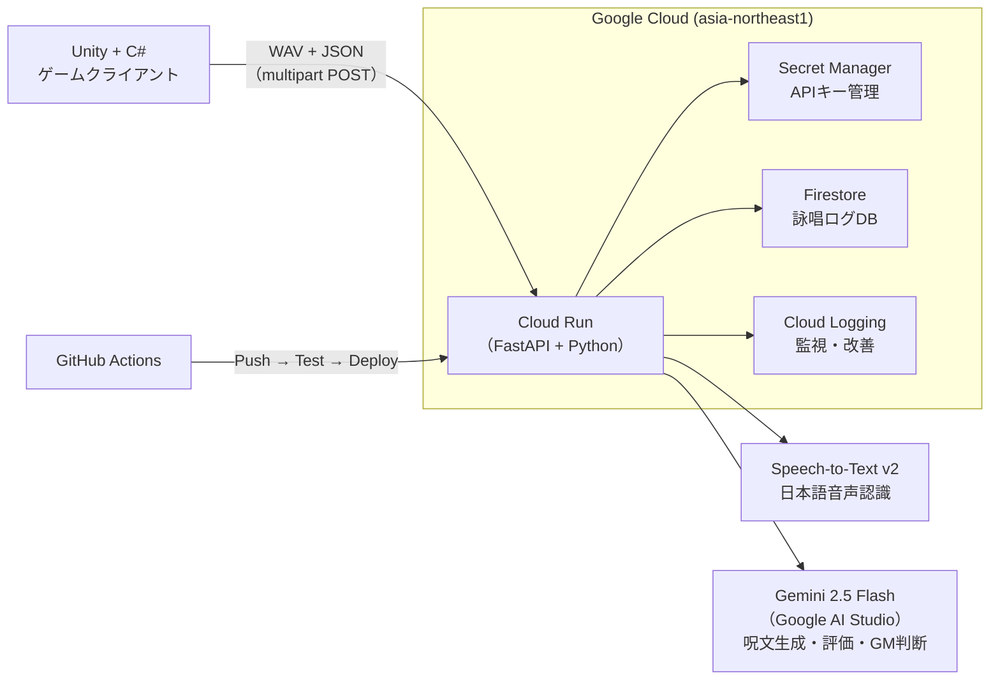

# 採用技術まとめ

AI Grimoire のハッカソン提出版で採用する技術スタックを 1 つ提案する。

---

## 推奨構成（確定版）



---

## 採用技術一覧

| カテゴリ | 技術 | バージョン/モデル | 理由 |
|---|---|---|---|
| ゲームクライアント | Unity | 最新LTS | チームの既存スキル |
| ゲームロジック | C# | - | Unity標準 |
| API フレームワーク | **FastAPI** | 最新安定版 | 非同期・型安全・Python |
| AI モデル | **Gemini 2.5 Flash** | Google AI Studio | 速度・コスト・日本語品質のバランス |
| 音声認識 | **Speech-to-Text v2** | `latest_short` | 日本語対応・無料枠 |
| バックエンド実行環境 | **Cloud Run** | - | ハッカソン要件・スケールゼロ |
| データストア | **Firestore** | Native mode | JSON的、無料枠大 |
| シークレット管理 | **Secret Manager** | - | APIキーをコードに書かない |
| CI/CD | **GitHub Actions** | - | ハッカソン要件・Push即デプロイ |
| ログ | **Cloud Logging** | - | Cloud Runに自動連携 |
| 音声特徴量抽出 | **librosa** | 最新版 | RMS・速度・ピッチ抽出 |
| テキスト類似度 | **rapidfuzz** | 最新版 | 発音一致率の計算 |
| 音声読み上げ | **Text-to-Speech** | 標準音声 | AI魔導書の読み上げ |

---

## 採用しないもの（理由付き）

| 技術 | 採用しない理由 |
|---|---|
| Vertex AI（Gemini） | 初期設定が複雑。AI Studio 経由で十分 |
| Firebase Authentication | MVP では UUID で代替できる。SDK追加でUnityビルドが複雑化 |
| Cloud Storage | MVP では不要。音声はメモリ内で処理 |
| gRPC / ストリーミング STT | 実装コストが高い。バッチ認識で十分 |
| SpeechBrain / 感情認識ML | Cloud Run でのホスティングが重い。librosa で代用 |
| GKE / App Engine | オーバースペック |
| OpenAI Whisper | GCP縛りから外れる。要件違反 |
| WebSocket | MVP では不要 |

---

## 技術選定の理由まとめ

### Gemini 2.5 Flash を選んだ理由

- 2026年5月時点で新規プロジェクト推奨モデル（2.0系は非推奨）
- 速度・コストのバランスが最良
- Structured Output（JSON強制出力）に対応
- Google AI Studio の無料枠で動かせる

### Cloud Run を選んだ理由

- ハッカソン必須要件「Google Cloud アプリケーション実行プロダクト」に完全対応
- Dockerfile さえ書けば FastAPI を即デプロイできる
- スケールゼロで無料枠内に収まりやすい
- GitHub Actions との自動デプロイ連携が公式サポートされている

### FastAPI を選んだ理由

- Gemini SDK・librosa・Speech-to-Text SDK が Python 製のため、統一言語で書ける
- Pydantic による Structured Output との相性が良い（同じスキーマを流用できる）
- Cloud Run + FastAPI の公式クイックスタートが存在する

---

## 実装優先順位（再掲）

### 開発環境の分離方針

| レイヤー | 環境 | Docker |
|---|---|---|
| Unity ゲーム本体 | Mac上でUnity Editorを直接起動 | **不要・使わない** |
| Backend（FastAPI） | ローカルは Python venv で十分 | Cloud Run載せる段階で書く |
| Cloud Run | コンテナ前提 | **必要** |

> Unity EditorはGUI・マイク入力・Scene操作・Inspector・Animatorが必要なためDockerと根本的に相性が悪い。Dockerを使うのはバックエンドとCloud Runデプロイ時のみ。

```
Mac
├── Unity Editor（直接起動）
├── Claude Code / Codex
└── Backend
    ├── 開発中: Python venv
    └── Cloud Run載せる時: Dockerfile
```

---

### フェーズ1：骨格を作る

1. FastAPI で `POST /evaluate` を実装（モックで返すだけでOK）
2. Cloud Run に手動デプロイ
3. Unity から HTTP POST で疎通確認

### フェーズ2：AIを繋げる

4. Speech-to-Text で音声をテキストに変換
5. rapidfuzz で発音一致率を算出
6. Gemini 2.5 Flash で呪文生成（`POST /generate-spell`）
7. Structured Output でGMコメント生成（`POST /master-judge`）

### フェーズ3：データを繋げる

8. Firestore にログを保存
9. Secret Manager に APIキーを移行
10. GitHub Actions で自動デプロイ化

### フェーズ4：デモを仕上げる

11. Text-to-Speech でAI魔導書の読み上げ
12. リザルト総評（`GET /result/{session_id}`）
13. 30秒デモフローを固定して練習

---

## ハッカソン審査チェックリスト

| 要件 | 対応技術 | 状態 |
|---|---|---|
| Cloud Run でアプリを実行 | Cloud Run + FastAPI | 計画済み |
| Gemini API 使用 | Gemini 2.5 Flash | 計画済み |
| Speech-to-Text 使用 | Speech-to-Text v2 | 計画済み |
| Text-to-Speech 使用 | Cloud TTS | 計画済み |
| GitHub Actions CI/CD | GitHub Actions + deploy-cloudrun | 計画済み |
| ログ収集 | Cloud Logging（自動） | 計画済み |
| 改善サイクル | ログ → プロンプト改善 → Push → 再デプロイ | 設計済み |

---

## リスクと緩和策（再掲）

| リスク | 緩和策 |
|---|---|
| コールドスタートが遅い | `startup_cpu_boost` 有効化、または `min-instances=1` |
| librosa でコンテナが重くなる | 音量のみ `pydub` で代替（軽量） |
| Gemini レート制限 | Gemini 2.5 Flash-Lite にフォールバック |
| ワークフロー設定で詰まる | サービスアカウントキー方式に切り替え（時間優先） |

詳細は [[08_リスクと対策]] を参照。

---

## 関連ノート

- [[tech/AI側技術調査]]
- [[tech/バックエンド構成]]
- [[tech/API設計]]
- [[tech/音声評価ロジック]]
- [[tech/Google Cloud構成]]
- [[tech/GitHub ActionsとCI_CD]]
- [[01_ハッカソン要件対応]]
- [[05_技術構成]]

### Unity / Claude Code 開発ナレッジ

- [[Claude CodeとCodexによるUnity 2Dゲーム開発の概要]] — AIが得意・苦手な領域、役割分担
- [[Unity プロジェクトのCLAUDE.md設計]] — CLAUDE.mdテンプレート（Unity固有の必須記載）
- [[AI Unityゲーム開発ワークフロー]] — フェーズ別開発プロセス
- [[Unity AIツール比較]] — Claude Code / Codex / Copilot の比較
