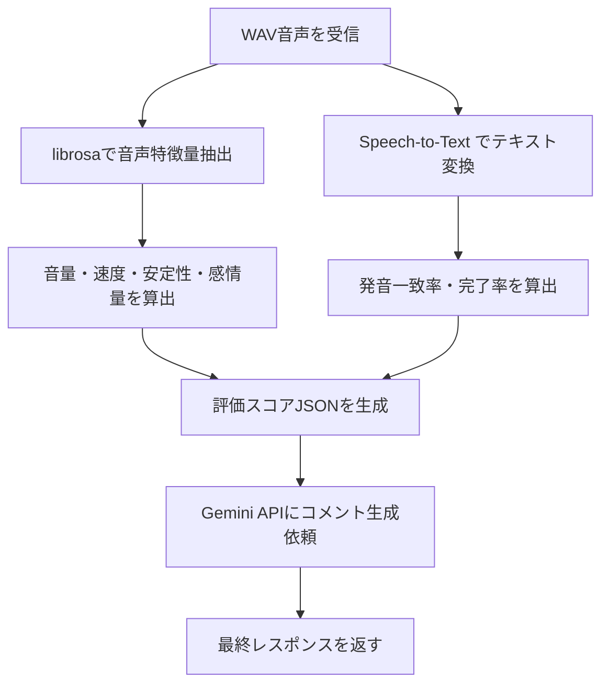

# 音声評価ロジック

詠唱音声を受け取り、多次元の評価スコアを算出するロジックの設計ノート。

---

## 評価パイプライン全体



---

## 評価指標と実装方法

### カテゴリ1：テキスト系（Speech-to-Text の結果を使う）

| 評価指標 | 計算方法 | ライブラリ |
|---|---|---|
| **発音一致率** | `rapidfuzz.ratio(正解テキスト, STT認識テキスト) / 100` | `rapidfuzz` |
| **キーワード認識率** | 呪文の重要単語が認識テキストに含まれる割合 | Python標準 |
| **詠唱完了率** | 認識単語数 / 正解単語数（上限1.0） | Python標準 |
| **誤認識数** | Levenshtein 編集距離の「置換・削除」操作の数 | `rapidfuzz` |

**一致率計算の考え方：**

```
例：
  正解テキスト：「闇よ、我が右手に宿れ、滅びの焔となりて敵を穿て」
  STT出力：    「闇よ、我が右手に宿れ、滅びの炎となりて敵を貫け」
  → 文字列類似度：約 93%（"焔"→"炎"、"穿て"→"貫け" の差）
```

### カテゴリ2：音響系（librosaで抽出）

| 評価指標 | 計算方法 | 出力形式 |
|---|---|---|
| **音量（RMS）** | 全フレームの RMS エネルギーの平均・最大値 | float（dB換算も可） |
| **音量カテゴリ** | RMS 値を閾値で `loud / normal / quiet` に分類 | string |
| **詠唱速度（WPM）** | STT の word_time_offsets から (単語数 / 所要秒数 × 60) | float |
| **声の安定性** | RMS フレーム列の標準偏差（低いほど安定） | float |
| **詰まり（無音区間数）** | `librosa.effects.split` で検出した無音区間の数 | int |
| **感情量（簡易）** | ピッチ変動（YIN）の標準偏差を感情量の代理指標とする | float |

### カテゴリ3：ゲームパラメータへの変換

評価スコアを最終的な「詠唱威力」に変換する。

```
spell_power = base_power
  × match_rate_factor    （発音一致率が高いほど上昇）
  × volume_factor        （大声で上昇、小声で隠密ボーナス）
  × speed_factor         （適切な速度でボーナス）
  × completion_factor    （完走でボーナス）
  × stability_factor     （安定ほど上昇）
```

各 factor の算出例：

| factor | 計算式 |
|---|---|
| match_rate_factor | `0.5 + match_rate × 1.0`（最低0.5、最高1.5） |
| volume_factor | `loud=1.3 / normal=1.0 / quiet=0.8`（隠密は別扱い） |
| speed_factor | `fast=1.2 / normal=1.0 / slow=0.9` |
| completion_factor | `completion_rate`（0〜1.0） |
| stability_factor | `1.0 - stability_stddev × 0.3`（不安定ほど下がる） |

---

## Pythonライブラリ詳細

### rapidfuzz

- **用途：** 発音一致率・誤認識数の計算
- **関数：** `rapidfuzz.fuzz.ratio(s1, s2)` → 0〜100 の類似度
- **特徴：** `difflib.SequenceMatcher` より10〜100倍高速
- **インストール：** `pip install rapidfuzz`
- **参考：** https://github.com/rapidfuzz/RapidFuzz

### librosa

- **用途：** 音量・ピッチ・無音区間の抽出
- **主な関数：**
  - `librosa.load(path, sr=16000)` - 音声読み込み（リサンプリングあり）
  - `librosa.feature.rms(y=y)` - RMSエネルギー
  - `librosa.yin(y, fmin=80, fmax=400)` - ピッチ（YINアルゴリズム）
  - `librosa.effects.split(y, top_db=30)` - 無音区間分割
- **注意：** `numba` に依存するためコールドスタートが重い。Cloud Run のコンテナに含める場合は Docker ビルドに含めること
- **参考：** https://librosa.org/doc/latest/index.html

### webrtcvad（オプション）

- **用途：** 高精度な発話区間検出（VAD）
- **特徴：** WebRTC の Voice Activity Detection 実装
- **用途：** `librosa.effects.split` より精度が高い（詰まり・息切れ検出向け）
- **インストール：** `pip install webrtcvad`（要確認：Cloud Run 上の動作）

---

## 実装優先順位

### MVP（最低限）

1. Speech-to-Text でテキスト変換
2. `rapidfuzz.ratio` で発音一致率を算出
3. WAV を `librosa.load` で読み込み
4. `librosa.feature.rms` で音量を算出
5. STT の word_time_offsets で速度を算出
6. 上記を JSON にまとめて Gemini に渡す

### 発展

- `librosa.yin` でピッチ・感情量推定
- `librosa.effects.split` で詰まり・無音区間検出
- 声の安定性スコアを算出
- 羞恥耐性指標の設計（要確認：実装方法は未定）

---

## 注意点・要確認事項

- **要確認：** Cloud Run の Python コンテナに `librosa` を含めるとコンテナサイズが大きくなる（500MB〜1GB程度）。Cloud Run の制限（最大8GB）は問題ないが、起動時間が長くなる
- **要確認：** WAV のサンプルレート変換（Unity 44100Hz → STT推奨 16000Hz）はサーバー側で `librosa.load(sr=16000)` で自動リサンプリングできる
- **要確認：** 詠唱時間が短い（1〜2秒）場合、ピッチ推定の精度が低下する可能性がある
- 感情量の推定は機械学習モデル（SpeechBrain等）を使うと高精度だが、Cloud Run でのホスティングは重い。ピッチ変動で代用する簡易実装を推奨

---

## ゲーム内効果の早見表

| 評価指標 | 高い場合 | 低い場合 |
|---|---|---|
| 発音一致率 | 威力上昇 | 属性ランダム変化 |
| 音量（大声） | 高火力 | - |
| 音量（小声） | - | 隠密ボーナス（別属性） |
| 詠唱速度（速い） | DPS上昇 | - |
| 詠唱速度（遅い） | - | 敵が先制しやすい |
| 完了率 | ボーナスダメージ | 魔法不発 |
| 詰まり数 | - | MP小消費 |
| 感情量（高い） | 火力ブースト | - |
| 声の安定性 | 集中度ボーナス | - |

---

## 関連ノート

- [[04_音声詠唱評価項目]]
- [[tech/AI側技術調査]]
- [[tech/API設計]]
- [[tech/バックエンド構成]]
